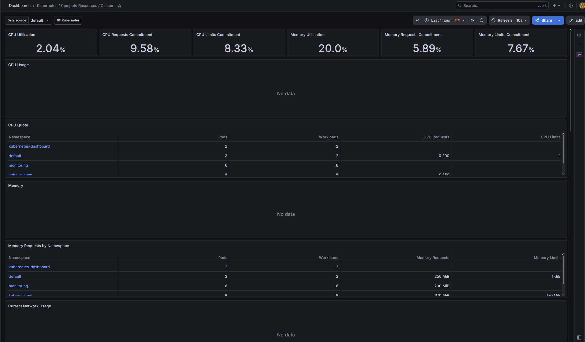
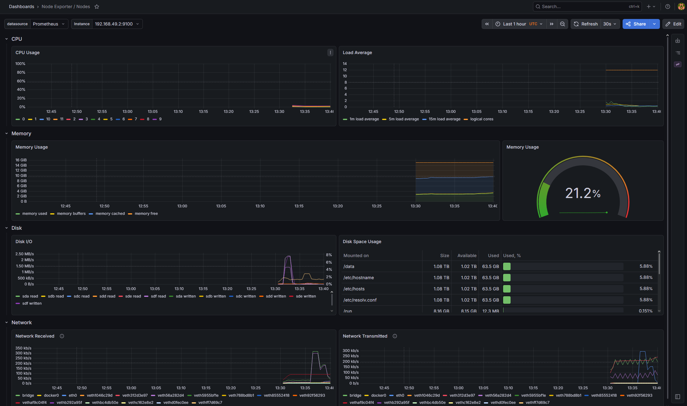
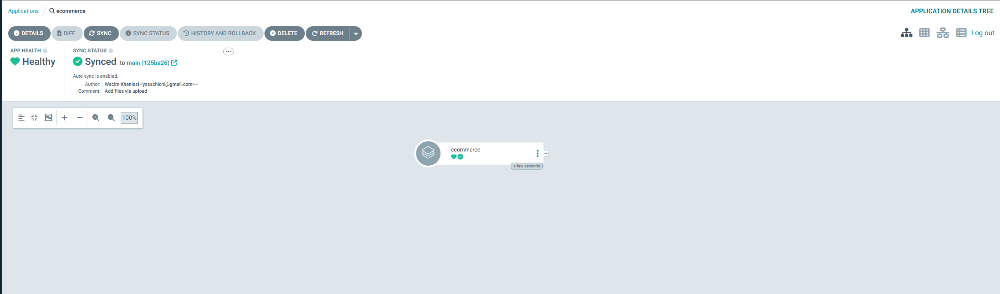

# DevOps E-Commerce Platform


Plateforme e-commerce microservices industrialisée de bout en bout : du développement local jusqu'au déploiement continu en GitOps, avec monitoring et CI/CD automatisés.

Ce projet met en œuvre les pratiques DevOps modernes de manière end-to-end : conteneurisation, orchestration Kubernetes, intégration continue, observabilité et déploiement déclaratif.

---

## Architecture

```
┌─────────────┐     ┌──────────────┐     ┌─────────────────┐
│   GitHub    │────▶│GitHub Actions│────▶│   Tests (CI)    │
│   (source)  │     │   (CI/CD)    │     │  Jest+Supertest │
└──────┬──────┘     └──────────────┘     └─────────────────┘
       │
       │  surveille (GitOps)
       ▼
┌─────────────┐     ┌──────────────────────────────────────┐
│   ArgoCD    │────▶│         Cluster Kubernetes           │
│ (auto-sync) │     │  ┌────────┐ ┌──────────┐ ┌────────┐  │
└─────────────┘     │  │  API   │ │ Postgres │ │ Redis  │  │
                    │  │ (x2)   │ │          │ │        │  │
                    │  └────────┘ └──────────┘ └────────┘  │
                    │                                       │
                    │  ┌─────────────────────────────────┐ │
                    │  │ Prometheus + Grafana (monitoring) │ │
                    │  └─────────────────────────────────┘ │
                    └──────────────────────────────────────┘
```

---

## Stack technique

| Catégorie | Technologie |
|-----------|-------------|
| Application | Node.js, Express |
| Tests | Jest, Supertest |
| Conteneurisation | Docker (multi-stage), Docker Compose |
| Orchestration | Kubernetes (minikube / EKS) |
| Package Manager | Helm |
| CI/CD | GitHub Actions |
| GitOps | ArgoCD |
| Monitoring | Prometheus, Grafana |
| Base de données | PostgreSQL |
| Cache | Redis |
| Infrastructure as Code | Terraform |

---

## Fonctionnalités mises en œuvre

- API REST Node.js/Express avec endpoints métier et endpoint `/health` pour les health checks
- Tests automatisés (Jest + Supertest) avec séparation logique/serveur pour la testabilité
- Dockerfile multi-stage optimisé : image finale légère, utilisateur non-root, healthcheck intégré
- Environnement local reproductible avec Docker Compose (API + PostgreSQL + Redis)
- Déploiement Kubernetes : Deployment avec réplicas (haute disponibilité), readiness/liveness probes, limites de ressources
- Service Kubernetes comme point d'accès stable et load balancer interne
- Pipeline CI/CD GitHub Actions : tests automatiques à chaque push et pull request
- Stack d'observabilité Prometheus + Grafana déployée via Helm
- GitOps avec ArgoCD : synchronisation automatique, auto-réparation (selfHeal), pruning

---

## Quick Start (local)

### Prérequis
- Docker Desktop
- minikube, kubectl, Helm

### Lancer en local avec Docker Compose
```bash
git clone https://github.com/wacimkh/devops-ecommerce-platform
cd devops-ecommerce-platform
docker compose up -d
# API disponible sur http://localhost:3000/api/products
```

### Déployer sur Kubernetes
```bash
minikube start --driver=docker --cpus=4 --memory=6144
minikube image build -t ecommerce-api:latest ./apps/api
kubectl apply -f kubernetes/base/deployments/
kubectl apply -f kubernetes/base/services/
kubectl get pods
```

### Installer le monitoring
```bash
helm repo add prometheus-community https://prometheus-community.github.io/helm-charts
helm install monitoring prometheus-community/kube-prometheus-stack \
  --namespace monitoring --create-namespace
minikube service monitoring-grafana -n monitoring
```

### Déployer ArgoCD (GitOps)
```bash
kubectl create namespace argocd
kubectl apply -n argocd -f https://raw.githubusercontent.com/argoproj/argo-cd/stable/manifests/install.yaml
kubectl apply -f argocd/application.yaml
minikube service argocd-server -n argocd
```

---

## Monitoring (Prometheus + Grafana)

Le cluster est monitoré avec la stack Prometheus + Grafana, déployée via Helm. Les métriques de CPU, mémoire, disque et réseau sont collectées automatiquement.

### Dashboard Kubernetes - Compute Resources


### Dashboard Node Exporter - Métriques système


---

## GitOps (ArgoCD)

Le déploiement est géré en GitOps avec ArgoCD : l'application est automatiquement synchronisée avec l'état décrit dans le dépôt Git. Toute modification poussée sur la branche main est déployée sans intervention manuelle, avec auto-réparation en cas de dérive.

### Application ArgoCD - Synced & Healthy


## Structure du projet

```
devops-ecommerce-platform/
├── .github/workflows/      # Pipelines CI/CD GitHub Actions
├── apps/
│   ├── api/                # API Node.js + Dockerfile + tests
│   ├── frontend/           # Frontend (a venir)
│   └── worker/             # Worker (a venir)
├── kubernetes/
│   ├── base/               # Manifests K8s (deployments, services)
│   └── overlays/           # Surcharges par environnement
├── argocd/                 # Application ArgoCD (GitOps)
├── terraform/              # Infrastructure as Code (AWS)
├── monitoring/             # Configuration Prometheus/Grafana
├── docs/
│   └── screenshots/        # Captures du projet en fonctionnement
├── docker-compose.yml      # Stack locale complete
└── README.md
```

---

## Roadmap

- [x] API Node.js + tests automatisés
- [x] Conteneurisation Docker multi-stage
- [x] Docker Compose (dev local)
- [x] Déploiement Kubernetes
- [x] Pipeline CI/CD GitHub Actions
- [x] Monitoring Prometheus + Grafana
- [x] GitOps avec ArgoCD
- [ ] Sécurité (RBAC, Network Policies, scan Trivy)
- [ ] Déploiement cloud AWS (EKS, ECR) avec Terraform

---

## Auteur

Wacim Khenissi - [@wacimkh](https://github.com/wacimkh)

Projet réalisé dans le cadre de ma montée en compétences DevOps.

---

## Licence

Ce projet est sous licence MIT - voir le fichier [LICENSE](LICENSE) pour plus de détails.
